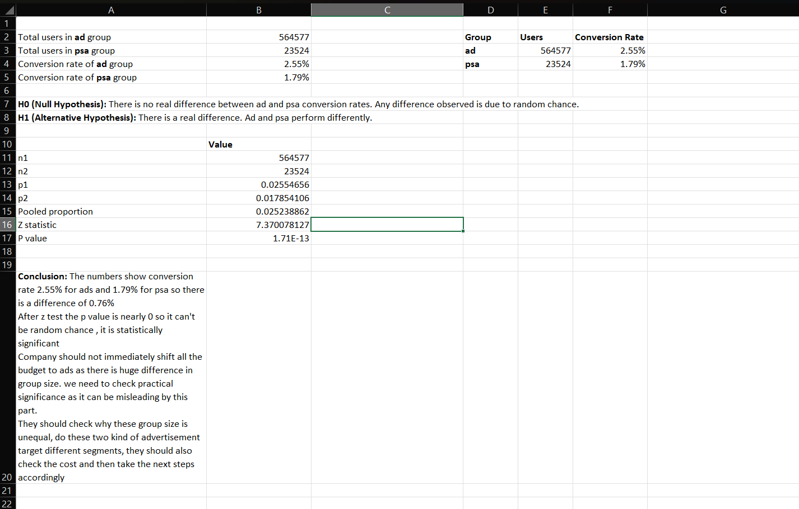

## Marketing A/B Test Analysis

### Business Question
Should the company shift its advertising budget from public service announcements to paid ads, or are the unequal group sizes making the results unreliable?

### Dataset
Source- Kaggle 

Size- 21466kB, 588102 rows 

Column- 7 columns

-Index: Row index

-user id: User ID (unique)

-test group: If "ad" the person saw the advertisement, if "psa" they only saw the public service announcement

-converted: If a person bought the product then True, else is False

-total ads: Amount of ads seen by person

-most ads day: Day that the person saw the biggest amount of ads

-most ads hour: Hour of day that the person saw the biggest amount of ads

### Method
First defined null hypothesis and alternate hypothesis, then ran z-test to find p-value 

If p-value>0.05, fail to reject the null hypothesis 

If p-value<0.05, reject the null hypothesis 

### Key Findings
- Conversion rate — Ad: 2.55% | PSA: 1.79%
- p-value is nearly zero so, so the result is statistically significant
- Near-zero p-value proves statistical significance, but it does not automatically mean that it practically significant too for the business.

  

### Recommendation
The numbers show conversion rate 2.55% for ads and 1.79% for psa so there is a difference of 0.76%. After z test the p value is nearly 0 so it can't be random chance , it is statistically significant.

Company should not immediately shift all the budget to ads as there is huge difference in group size. we need to check practical significance as it can be misleading by this part. One should check why these group size is unequal, do these two kind of advertisement target different segments, they should also check the cost and then take the next steps accordingly. 

### Tools Used
Microsoft Excel — manual z-test, formula-based analysis
